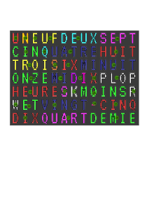

# FrenchWordCLock
A word clock in french - using ESP32

#### Clock text
UNEUFDEUXSEPT  
CINQUATREHUIT  
TROISIXMINUIT  
ONZEMIDIXPLOP  
HEURESKMOINSR  
WETVINGT-CINQ  
DIXQUARTDEMIE  

#### choosen font
https://fonts.google.com/specimen/VT323

#### Hours :
- Minuit
- Une heure
- Deux heures
- Trois heures
- Quatre heures
- Cinq heures
- Six heures
- Sept heures
- Huit heures
- Neuf heures
- Dix heures
- Onze heures
- Midi

#### Minutes :
- cinq
- dix
- et quart
- vingt
- vingt-cinq
- et demie
- moins vingt-cinq
- moins vingt
- moins le quart
- moins dix
- moins cinq